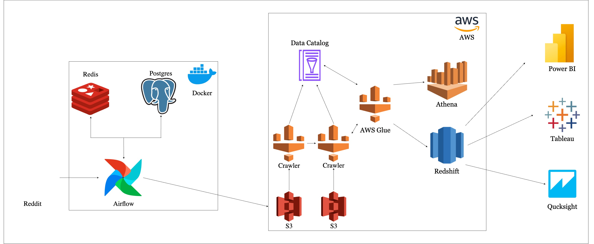

# Comprehensive Data Pipeline for Reddit Analytics

This project demonstrates a robust ETL (Extract, Transform, Load) pipeline to process Reddit data and store it in an Amazon Redshift data warehouse for advanced analytics. By leveraging a suite of modern tools and cloud services, this pipeline ensures scalability, reliability, and efficiency.

## 🚀 Features

- **Automated Data Extraction**: Seamlessly fetch data from Reddit using its API.
- **Cloud Storage**: Store raw data securely in Amazon S3.
- **Data Transformation**: Utilize AWS Glue and Amazon Athena for efficient data processing.
- **Data Warehousing**: Load transformed data into Amazon Redshift for querying and analytics.
- **Orchestration**: Manage and schedule tasks with Apache Airflow and Celery.
- **Scalable Architecture**: Designed to handle large datasets with ease.

---

## 📚 Table of Contents

- [Overview](#overview)
- [Architecture](#architecture)
- [Prerequisites](#prerequisites)
- [System Setup](#system-setup)
- [How It Works](#how-it-works)
- [Future Enhancements](#future-enhancements)

---

## 📝 Overview

This pipeline is tailored to:

1. **Extract**: Gather data from Reddit's API.
2. **Transform**: Process and clean the data using AWS Glue and Athena.
3. **Load**: Store the processed data in Amazon Redshift for further analysis.

The solution is ideal for building Reddit-based analytics dashboards, conducting sentiment analysis, or performing trend analysis.

---

## 🏗️ Architecture

The pipeline integrates the following components:

1. **Reddit API**: Acts as the data source.
2. **Apache Airflow & Redis**: Orchestrates the ETL workflow and distributes tasks.
3. **PostgreSQL**: Manages metadata and serves as temporary storage.
4. **Amazon S3**: Stores raw data securely.
5. **AWS Glue**: Handles data cataloging and transformation jobs.
6. **Amazon Athena**: Enables SQL-based querying for data transformation.
7. **Amazon Redshift**: Serves as the data warehouse for analytics.



---

## ✅ Prerequisites

Before setting up the pipeline, ensure you have:

- An **AWS Account** with permissions for S3, Glue, Athena, and Redshift.
- **Reddit API Credentials** for data extraction.
- **Docker** installed on your system.
- **Python 3.9+** installed.

---

## ⚙️ System Setup

Follow these steps to set up the pipeline:

1. **Clone the Repository**:
   ```bash
   git clone https://github.com/Raja0210/Reddit-Project.git
   ```

2. **Create a Virtual Environment**:
   ```bash
   python3 -m venv venv
   ```

3. **Activate the Virtual Environment**:
   ```bash
   source venv/bin/activate
   ```

4. **Install Dependencies**:
   ```bash
   pip install -r requirements.txt
   ```

5. **Configure the Project**:
   Rename the example configuration file and update it with your credentials:
   ```bash
   mv config/config.conf.example config/config.conf
   ```

6. **Start the Containers**:
   Use Docker Compose to spin up the required services:
   ```bash
   docker-compose up -d
   ```

7. **Access the Airflow Web UI**:
   Open the Airflow dashboard in your browser:
   ```bash
   open http://localhost:8080
   ```
   
---

## 🌟 Future Enhancements

- **Real-Time Data Processing**: Integrate streaming tools like Apache Kafka.
- **Enhanced Monitoring**: Add dashboards for pipeline performance metrics.
- **Machine Learning Integration**: Use the data for predictive analytics and modeling.

---

This project is a powerful starting point for building scalable data pipelines and unlocking insights from Reddit data. Happy coding! 🚀
